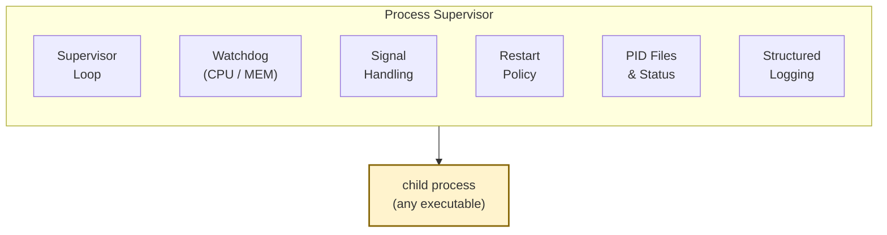
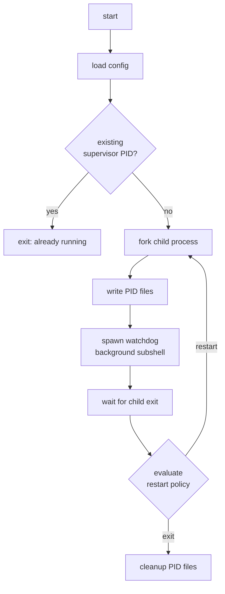
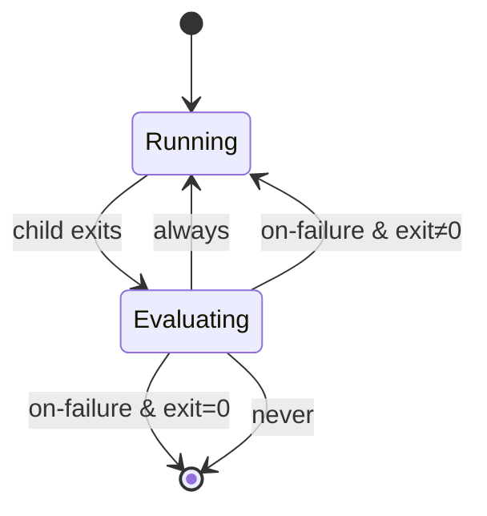
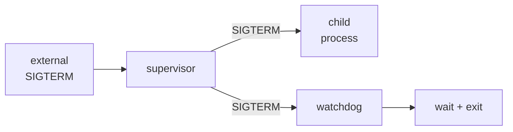

# 🛡️ Process Supervisor


A lightweight process supervisor written in Bash, containerized with Docker and deployed on Kubernetes. Handles PID 1 semantics, signal propagation, resource watchdogging and automatic restarts. Same set of problems real orchestrators solve, built from scratch.

> Built to understand what Kubernetes, systemd, and supervisord actually do when they manage a process. Bash because the constraints force you to confront PID 1 and signal forwarding directly instead of inheriting them from a runtime.

---

## Architecture



---

## Features

| Phase | Feature | Details |
|---|---|---|
| 1 | Dynamic proxy | Runs any command defined in config; supports arbitrary executables |
| 2 | Structured logging | Timestamped log lines to stdout + rotating daily log files |
| 3 | Resource watchdog | Per-process CPU % and memory MB limits; kills on breach |
| 4 | Restart policy | `always`, `on-failure`, or `never`; 1-second cooldown between restarts |
| 5 | Signal handling | `SIGTERM` / `SIGINT` propagate cleanly to child and watchdog |
| ★ | PID management | Supervisor and child PID files for external status queries |
| ★ | Status CLI | Live supervisor + child status with resource usage via `ps` |
| ★ | Config system | Plain `.conf` file; all knobs exposed as shell variables |

---

## Project Structure

```
process-supervisor/
├── supervisor.sh          # Bash process supervisor
├── my_worker.py           # Example worker process
├── configs/
│   └── example.conf       # Supervisor configuration
├── Dockerfile             # Container image definition
└── k8s/
    ├── deployment.yaml    # Kubernetes Deployment
    └── kustomization.yaml # Kustomize entrypoint
```

---

## Quick Start

**Option A: Local**
```bash
chmod +x supervisor.sh
./supervisor.sh start configs/example.conf
./supervisor.sh status configs/example.conf
./supervisor.sh tail configs/example.conf
./supervisor.sh stop configs/example.conf
```

**Option B: Docker**
```bash
docker build -t process-supervisor:local .
docker run --rm process-supervisor:local start configs/example.conf
```

**Option C: Kubernetes (kind)**
```bash
kind load docker-image process-supervisor:local --name kind
kubectl apply -k k8s
kubectl rollout restart deployment process-supervisor
```

**Check status:**
```bash
kubectl get pods
kubectl logs -l app=process-supervisor -f
```

---

## Configuration

```bash
NAME="demo_worker"
COMMAND="python /app/my_worker.py"
RESTART_POLICY="always"      # always | on-failure | never
MAX_CPU_PCT=90               # kill child if CPU exceeds this (0 = disabled)
MAX_MEM_MB=200               # kill child if RSS exceeds this (0 = disabled)
CHECK_INTERVAL=2             # watchdog poll interval in seconds
LOG_DIR="/app/logs"
PID_DIR="/tmp/process-supervisor"
```

---

## Docker

Slim base image, explicit `bash` install, cache cleanup, supervisor as PID 1:

```dockerfile
FROM python:3.12-slim
RUN apt-get update && apt-get install -y --no-install-recommends \
    bash ca-certificates \
 && rm -rf /var/lib/apt/lists/*
WORKDIR /app
COPY . /app
RUN chmod +x /app/supervisor.sh
CMD ["/app/supervisor.sh"]
```

---

## Kubernetes

Explicit `command` and `args` prevent the common error where Kubernetes treats arguments as executables:

```yaml
command: ["/app/supervisor.sh"]
args: ["start", "configs/example.conf"]
```

---

## Architecture Notes

**Request lifecycle**



**Restart policy state machine**



**Signal propagation**



---

## Tradeoffs & Limitations

| Limitation | Why | What a production level supervisor does |
|---|---|---|
| 1-second restart cooldown | Simple to implement; fine for demo workloads | Exponential backoff (systemd, supervisord) to avoid crash loops eating CPU |
| CPU% from `ps` is cumulative, not instantaneous | Portable, no `/proc` parsing | Reads `/proc/<pid>/stat` deltas or uses cgroup accounting |
| Single child per supervisor | Keeps signal handling and PID tracking trivial | Manages process trees with proper reaping (e.g. `tini`, `dumb-init`) |
| No log rotation by size, only by day | Bash + `date` is enough for the demo | `logrotate` or structured log shippers with size + age policies |
| Watchdog runs in a subshell, not a separate process group | Avoids `setsid` complexity | Dedicated supervisor process with proper isolation |

---

## Troubleshooting

| Error | Cause | Fix |
|---|---|---|
| `ImagePullBackOff` | Image not loaded into kind cluster | `kind load docker-image process-supervisor:local` |
| `RunContainerError` | Missing system dependency in image | Add to `apt-get install` in Dockerfile |
| `exec: "start": executable file not found` | Kubernetes merged `command` + `args` incorrectly | Use explicit `command` and `args` fields separately |
| `Permission denied` | Script not executable in image | Add `RUN chmod +x /app/supervisor.sh` to Dockerfile |

---

## Author

**Dimitrios Dalaklidis**
📧 dalaklidesdemetres@gmail.com · [LinkedIn](https://www.linkedin.com/in/dimitrios-dalaklidis) · [GitHub](https://github.com/DimitriosDalaklidhs)
